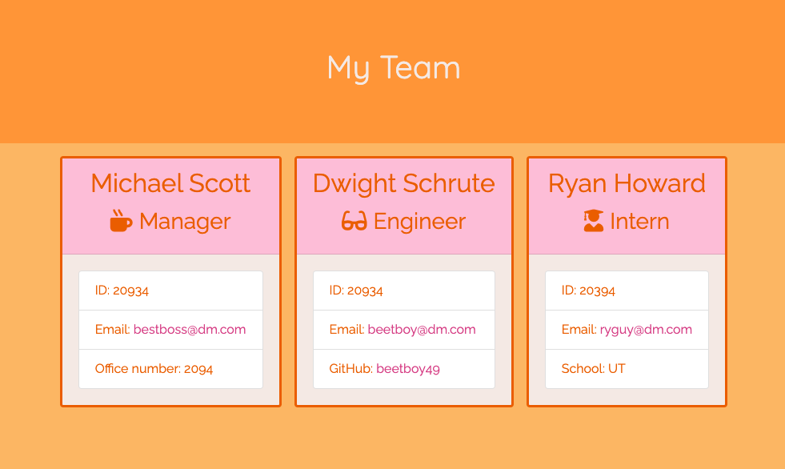

# Team Management Template
This app uses node.js to allow you to enter the information of your team and receive
a generated HTML template populated with your information. 

  

## Instructions
* Run ```node app.js``` in your command line/terminal
* Answer the sequence of questions
* When you are done and answer "No" to adding an additional team member, a file called ```team.html``` will generate with your information
  
  

## Technologies Used
* HTML
* CSS
* JavaScript
* Node
* BootStrap

## License
Copywrite 2020 Lili Clift Licensed under the MIT License.